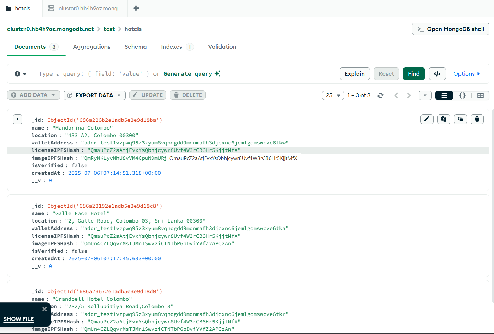

# Hotel Registry Service


### Used : Lucid Cardano is a JavaScript/TypeScript library for interacting with the Cardano blockchain
## Functionalities
1. Accept hotel registration data (name, location, documentations)
2. Upload documents (license and images) to IPFS
3. Store hotel records in MongoDB
4. Verify hotels and record verification status
5. Provide API access to list or filter hotels ( all, verified, pending)


## API endpoints

| Method   | Route                    | Function                                 |
| -------- | ------------------------ | ---------------------------------------- |
| `POST`   | `/api/hotels/register`   | Register a new hotel                     |
| `GET`    | `/api/hotels/:id`        | Get details of a specific hotel          |
| `GET`    | `/api/hotels`            | List all hotels                          |
| `GET`    | `/api/hotels/verified`   | List only verified hotels                |
| `GET`    | `/api/hotels/pending`    | List hotels awaiting verification        | | Search hotels by name or location        |
| `GET`    | `/api/hotels/:id/rooms`  | Get room details of a specific hotel     |
| `DELETE` | `/api/hotels/:id`        | (Optional) Remove a hotel (admin only)   |
| `PUT`    | `/api/hotels/:id/edit`   | (Optional) Edit hotel info (owner/admin) |

## Mongo DB confiduration


## Running Instructions

Follow the steps below to set up and run the **Hotel Registry Microservice** locally

### 1. Clone the Repository

```bash
git clone https://github.com/Travelok/HotelRegistry-Service.git
cd HotelRegistry-Service
```

### 2. Install Dependencies

```bash
npm install
```

### 3. Create a `.env` File

Create a `.env` file in the root directory and add the following:

```env
# Server Port
PORT=5001

# Cardano Blockchain - Blockfrost API Key (I used preprod)
BLOCKFROST_API_KEY=your_blockfrost_api_key_here

# IPFS Configuration
IPFS_PROJECT_ID=your_ipfs_project_id_here
IPFS_API_KEY=your_ipfs_api_key_here

# Pinata (or other IPFS service) JWT Token
PINATA_JWT=your_pinata_jwt_here


# Admin Wallet Private Key for NFT minting/verification
ADMIN_PRIVATE_KEY=your_admin_wallet_private_key_here

#If you want , can use keyGeneration.js to generate a new key
```

> Use [MongoDB Atlas](https://www.mongodb.com/cloud/atlas) for a free cloud MongoDB URI. (Use Assets/test.hotels.json to export data)
> Get [Pinata API keys](https://app.pinata.cloud/developer) for IPFS integration.

Follow thw [.env.example](.env.example)
### 4. Start the Server

```bash
node src/app.js
```

The server will run by default on `http://localhost:5001`.

