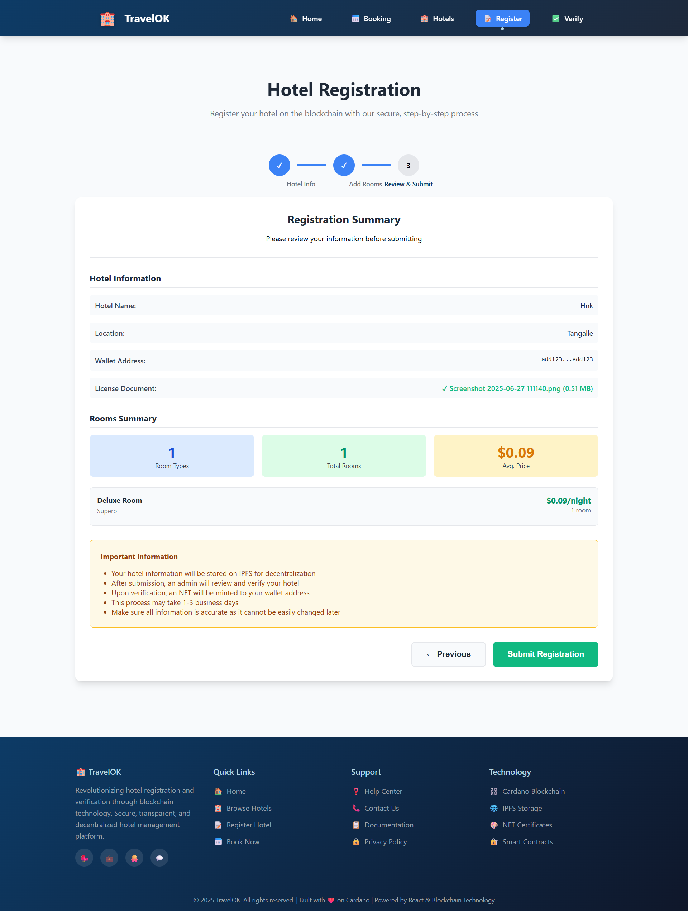

#  Frontend

An elegant, modern frontend for the decentralized hotel registration and verification platform built with React.


## Getting Started

### Prerequisites
- Node.js (v14 or higher) 22better
- npm or yarn
- Backend API server running

### Installation

1. **Clone the repository**
   ```bash
   git clone <repository-url>
   cd hotel-registry-frontend
   ```

2. **Install dependencies**
   ```bash
   npm install
   ```

3. **Configure environment variables**
   ```bash
   cp .env.example .env
   ```

   Update `.env` with your backend API URL:
   ```
   REACT_APP_API_URL=http://localhost:5000/api
   ```

4. **Start the development server**
   ```bash
   npm start
   ```

   The app will open at [http://localhost:3000](http://localhost:3000)

## Project Structure

```
src/
├── components/
│   ├── HotelRegistrationWizard.js    # Main registration wizard
│   ├── StepIndicator.js              # Progress indicator
│   ├── HotelBasicInfo.js             # Step 1: Basic information
│   ├── RoomManagement.js             # Step 2: Room management
│   ├── RegistrationSummary.js        # Step 3: Review & submit
│   ├── VerificationPanel.js          # Admin verification interface
│   └── RegisteredHotelsDisplay.js    # Public hotel listing
├── styles/
│   └── HotelRegistry.css             # Main styling
├── api.js                            # API integration
└── App.js                            # Main application component
```

## UI

### Home Page


### Hotel Registration

#### Step 1


#### Step 2


#### Step 3


### Booking


### Registered Hotels


### Verification - Only for Admin
